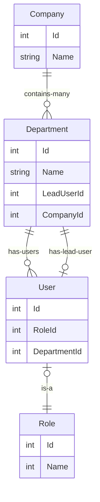

# Proof of concept of reusable includes

This proof of concept comes with an example project and the tests associates with it to
demonstrate the reusability.

Here is the example database that we will be using:



Here are an example of reusable includes using the wrapper created in this repository:

[Can be found here](./ReusableEfCoreIncludes.ExampleProject/ExampleIncludes.cs)

```csharp
public static class ExampleIncludes
{
    public static IUIncludable<T> IncludeCompany<T>(this IUIncludable<T> source, Include<T, Company> include) where T : class =>
        source.IncludeDepartment(q => q.IncludeManyFrom(include, r => r.Departments));
  
    public static IUIncludable<T> IncludeDepartment<T, P>(this IUIncludable<T> source, Include<T, P> include)
        where T : class where P : Department =>
        source
            .IncludeUser(q => q.IncludeManyFrom(include, r => r.Users))
            .IncludeFrom(include, e => e.LeadUser);


    public static IUIncludable<T> IncludeUser<T, P>(this IUIncludable<T> source, Include<T, P> include)
        where T : class where P : User =>
        source.IncludeFrom(include, e => e.Role);
}
```

Here is an example of the department include being reused.

[Can be found here](./ReusableEfCoreIncludes.Tests/MainTest.cs)

```csharp
[Test]
public async Task TestIncludeCompany()
{
    var company = await _context!.Companies
        .BeginInclude()
        .IncludeCompany(Include.FromBase) // which also includes the department, see above!
        .AsQueryable()
        .FirstOrDefaultAsync();
    AssertCompany(company);
}

[Test]
public async Task TestIncludeDepartments()
{
    var department = await _context!.Departments
        .BeginInclude()
        .IncludeDepartment(Include.FromBase) // include the department by itself
        .AsQueryable()
        .FirstOrDefaultAsync();
    AssertDepartment(department);
}
```
